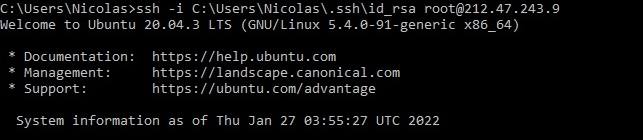
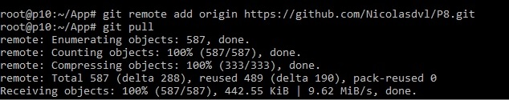
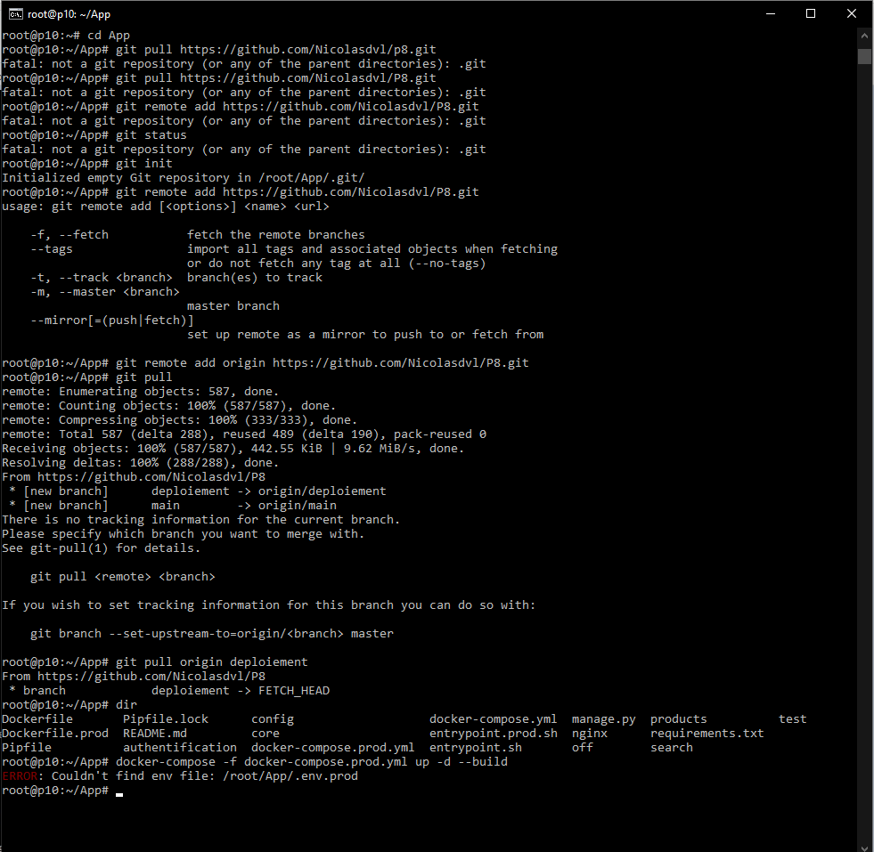
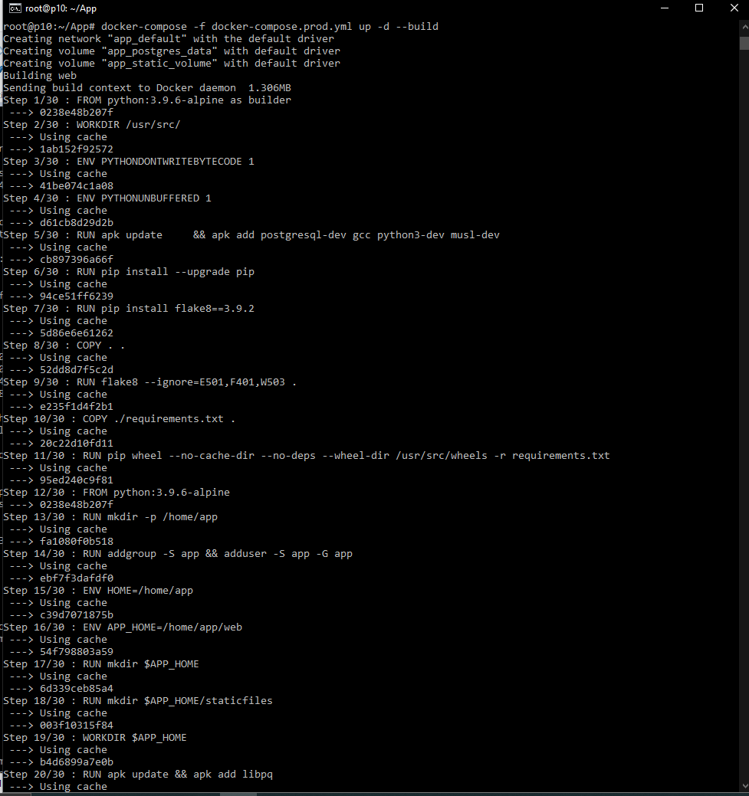
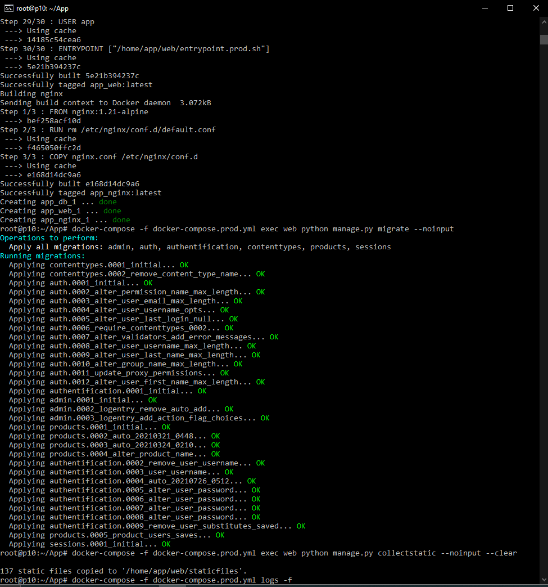
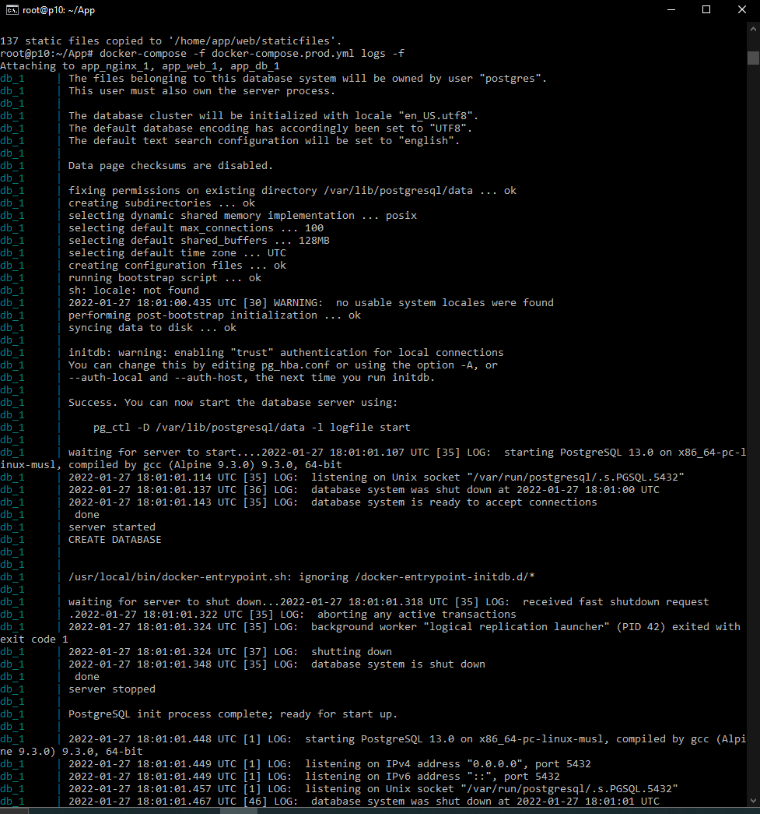
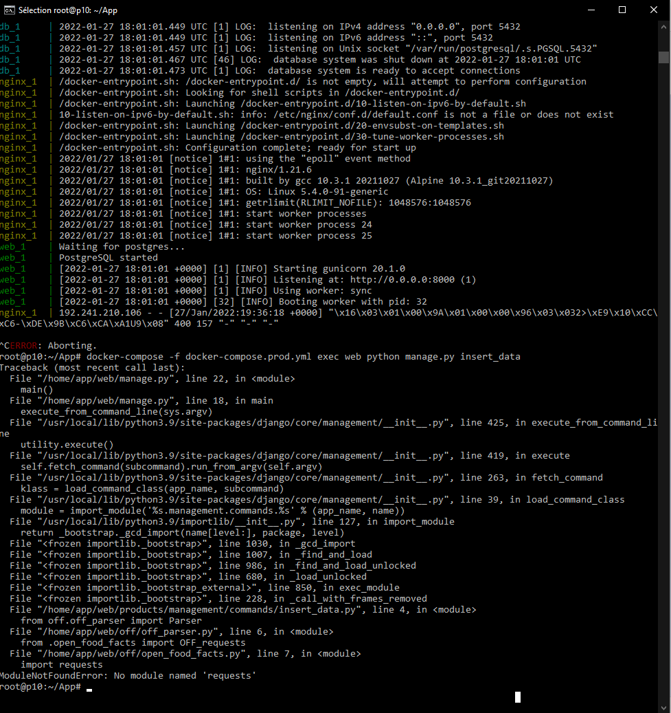

# Deploiement 
## Démarche

- Déployer l'application sur scaleway.

### Connection ssh to scaleway CLI

`ssh -i<public_key> root@<ip>`

### Pull p8 repo

`mkdir App`
`cd App`
`git init`
`git remote add origin <git_url>`

`git pull origin <branch>`

### Creating environnement files

`cat > .env.prod`

### Building app

`docker-compose.prod.yml up -d --build`

`docker-compose -f docker-compose.prod.yml exec web python manage.py migrate --noinput`
`docker-compose -f docker-compose.prod.yml exec web python manage.py collectstatic --noinput`

### Logs

## Problèmes

- Le site n'est pas accessible.
- La commande `manage.py insert_data` ne fonctionne pas.

## Démarche

- Ajouter le module 'requests' au fichier 'requierements.txt.
- Modifier 'settings.py' pour autoriser toutes les connections.
